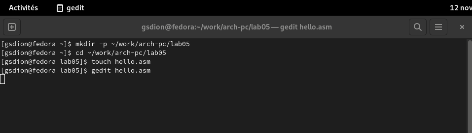
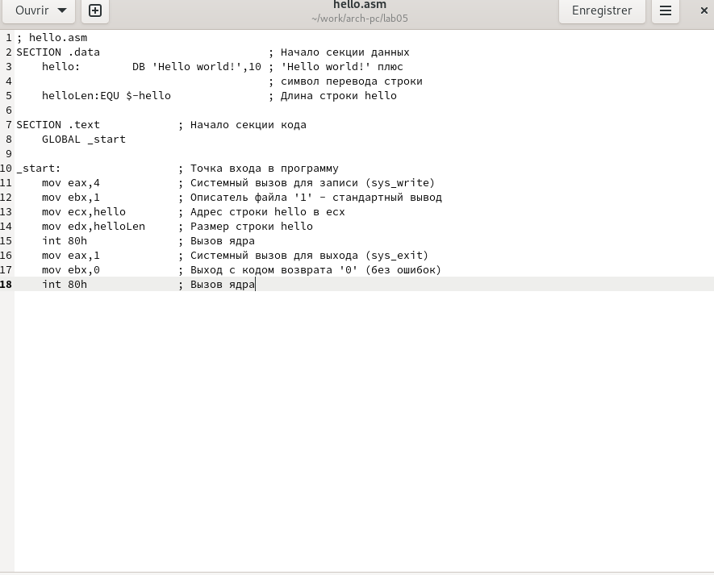
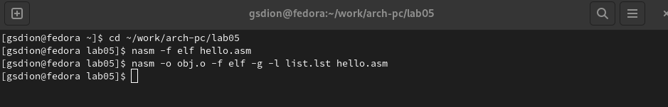
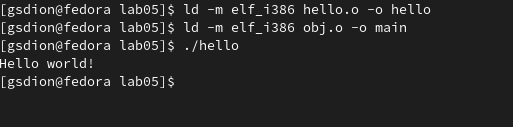
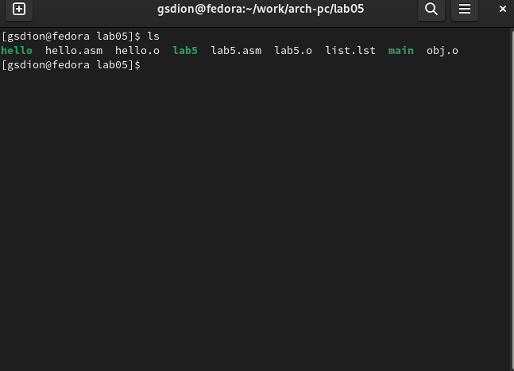
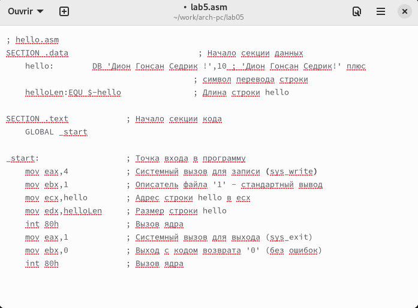
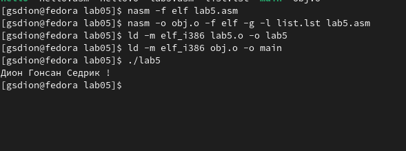
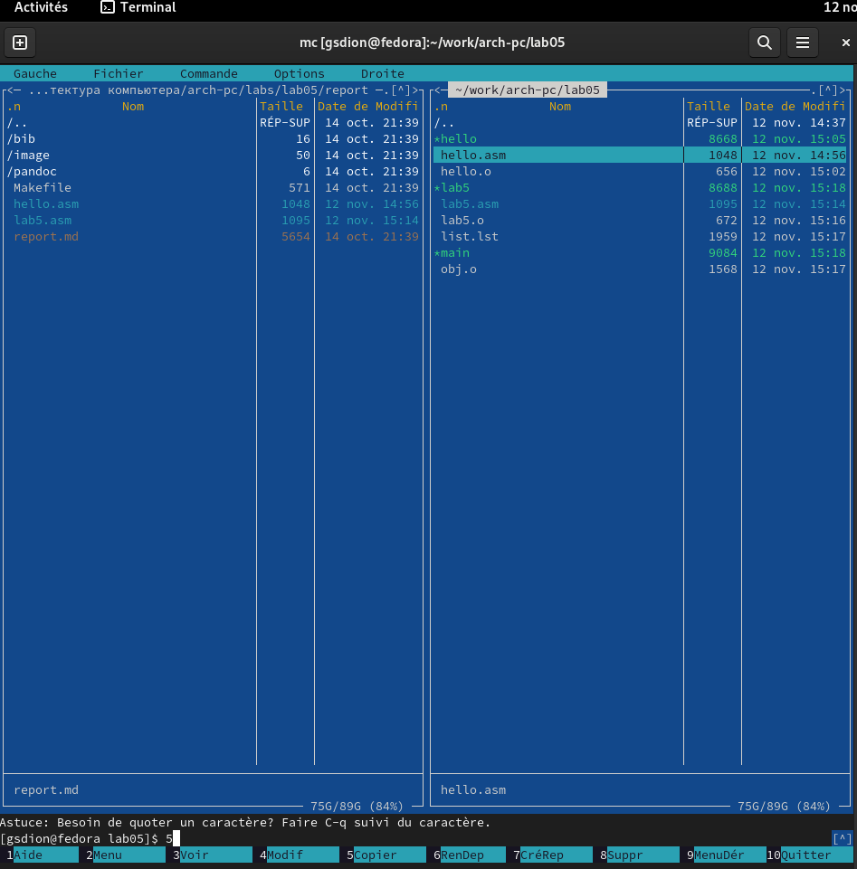

---
## Front matter
title: "Шаблон отчёта по лабораторной работе"
subtitle: "Простейший вариант"
author: "Дион Гонсан Седрик!"

## Generic otions
lang: ru-RU
toc-title: "Содержание"

## Bibliography
bibliography: bib/cite.bib
csl: pandoc/csl/gost-r-7-0-5-2008-numeric.csl

## Pdf output format
toc: true # Table of contents
toc-depth: 2
lof: true # List of figures
lot: true # List of tables
fontsize: 12pt
linestretch: 1.5
papersize: a4
documentclass: scrreprt
## I18n polyglossia
polyglossia-lang:
  name: russian
  options:
	- spelling=modern
	- babelshorthands=true
polyglossia-otherlangs:
  name: english
## I18n babel
babel-lang: russian
babel-otherlangs: english
## Fonts
mainfont: PT Serif
romanfont: PT Serif
sansfont: PT Sans
monofont: PT Mono
mainfontoptions: Ligatures=TeX
romanfontoptions: Ligatures=TeX
sansfontoptions: Ligatures=TeX,Scale=MatchLowercase
monofontoptions: Scale=MatchLowercase,Scale=0.9
## Biblatex
biblatex: true
biblio-style: "gost-numeric"
biblatexoptions:
  - parentracker=true
  - backend=biber
  - hyperref=auto
  - language=auto
  - autolang=other*
  - citestyle=gost-numeric
## Pandoc-crossref LaTeX customization
figureTitle: "Рис."
tableTitle: "Таблица"
listingTitle: "Листинг"
lofTitle: "Список иллюстраций"
lotTitle: "Список таблиц"
lolTitle: "Листинги"
## Misc options
indent: true
header-includes:
  - \usepackage{indentfirst}
  - \usepackage{float} # keep figures where there are in the text
  - \floatplacement{figure}{H} # keep figures where there are in the text
---

# Цель работы
Освоение процедуры компиляции и сборки программ, написанных на ассем-
блере NASM.
# Задание

1. В каталоге ~/work/arch-pc/lab05 с помощью команды cp создайте копию
файла hello.asm с именем lab5.asm
2. С помощью любого текстового редактора внесите изменения в текст про-
граммы в файле lab5.asm так, чтобы вместо Hello world! на экран выво-
дилась строка с вашими фамилией и именем.
3. Оттранслируйте полученный текст программы lab5.asm в объектный
файл. Выполните компоновку объектного файла и запустите получивший-
ся исполняемый файл.
4. Скопируйте файлы hello.asm и lab5.asm в Ваш локальный репозиторий
в каталог ~/work/study/2022-2023/"Архитектура компьютера"/arch-
pc/labs/lab05/. Загрузите файлы на Github.

# Теоретическое введение
Основными функциональными элементами любой электронно-вычислительной
машины (ЭВМ) являются центральный процессор, память и периферийные
устройства (рис. 5.1).
Взаимодействие этих устройств осуществляется через общую шину, к которой
они подключены. Физически шина представляет собой большое количество про-
водников, соединяющих устройства друг с другом. В современных компьютерах
проводники выполнены в виде электропроводящих дорожек на материнской
(системной) плате.
результатов выполнения инструкций; регистры процессора делятся на два
типа: регистры общего назначения и специальные регистры.
Для того, чтобы писать программы на ассемблере, необходимо знать, какие
регистры процессора существуют и как их можно использовать. Большинство
команд в программах написанных на ассемблере используют регистры в каче-
стве операндов. Практически все команды представляют собой преобразование
данных хранящихся в регистрах процессора, это например пересылка данных
между регистрами или между регистрами и памятью, преобразование (арифме-
тические или логические операции) данных хранящихся в регистрах.
Доступ к регистрам осуществляется не по адресам, как к основной памяти, а
по именам. Каждый регистр процессора архитектуры x86 имеет свое название,
состоящее из 2 или 3 букв латинского алфавита.
В качестве примера приведем названия основных регистров общего назначе-
ния (именно эти регистры чаще всего используются при написании программ):
• RAX, RCX, RDX, RBX, RSI, RDI — 64-битные
• EAX, ECX, EDX, EBX, ESI, EDI — 32-битные
• AX, CX, DX, BX, SI, DI — 16-битные
• AH, AL, CH, CL, DH, DL, BH, BL — 8-битные (половинки 16-битных реги-
стров). Например, AH (high AX) — старшие 8 бит регистра AX, AL (low AX) —
младшие 8 бит регистра AX.

# Выполнение лабораторной работы

1. Создайте каталог для работы с программами на языке ассемблера NASM. (рис. [-@fig:001])

{ #fig:001 width=70% }

2. файл с помощью любого текстового редактора, например, gedit с помощью команды gedit hello.asm. (рис. [-@fig:002])

{ #fig:002 width=70% }

3. Транслятор NASMКомпоновщик LD. (рис. [-@fig:003])

{ #fig:003 width=70% }

4. Компоновщик LD. (рис. [-@fig:004])

{ #fig:004 width=70% }

5. В каталоге ~/work/arch-pc/lab05 с помощью команды cp создайте копию
файла hello.asm с именем lab5.asm. (рис. [-@fig:008])

{ #fig:008 width=70% }

6. С помощью любого текстового редактора внесите изменения в текст про-
граммы в файле lab5.asm так, чтобы вместо Hello world! на экран выво-
дилась строка с вашими фамилией и именем. (рис. [-@fig:005])

{ #fig:005 width=70% }

7. Оттранслируйте полученный текст программы lab5.asm в объектный файл. Выполните компоновку объектного файла и запустите получившийся исполняемый файл. (рис. [-@fig:006])

{ #fig:006 width=70% }

8. Скопируйте файлы hello.asm и lab5.asm в Ваш локальный репозиторий в каталог ~/work/study/2022-2023/"Архитектура компьютера"/arch-pc/labs/lab05/,Загрузите файлы на Github. (рис .[-@fig:007])

{ #fig:007 width=70% }

# Выводы

В ходе этой лабораторной работы я приобрел практический навык в освоении процедур компиляции и ассемблера программ, написанных на ассемблере NASM.

# Список литературы{.unnumbered}

1. [Расширенный ассемблер: NASM](https://www.opennet.ru/docs/RUS/nasm/)
